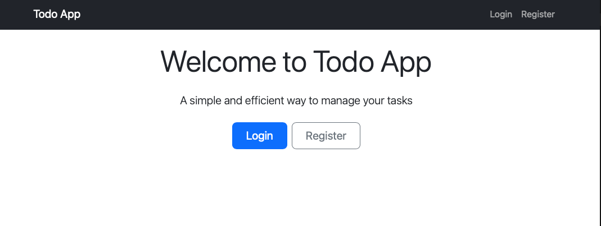
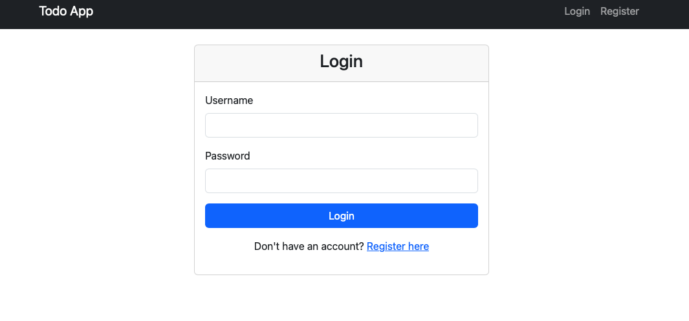
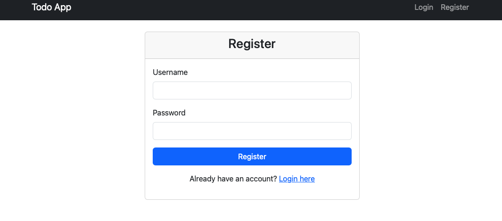

# Todo Web Application

A simple todo web application with user authentication and task management, built with Flask.

## Project Structure

```txt
to-do-web-app/
├── app.py              # Main application file
├── requirements.txt    # Python dependencies
├── Dockerfile         # Docker configuration
├── entrypoint.sh      # Docker entrypoint script
├── .env.example       # Example environment variables
├── instance/          # Instance-specific files (database)
└── templates/         # HTML templates
```

## Features

- User authentication (register, login, logout)
- Create, read, update, and delete tasks
- Set due dates for tasks
- Mark tasks as complete/incomplete
- Responsive design

## Views


*Main dashboard showing task management interface*


*User login interface*


*New user registration form*

## Prerequisites

- Python 3.11 or higher
- Docker (optional, for containerized deployment)

## Setup

1. Clone the repository:

```bash
git clone <your-repo-url>
cd to-do-web-app
```

1. Create and activate a virtual environment:

```bash
python -m venv venv
source venv/bin/activate  # On Windows: venv\Scripts\activate
```

1. Install dependencies:

```bash
pip install -r requirements.txt
```

1. Create a `.env` file:

```bash
cp .env.example .env
```

Then edit `.env` and set your own `SECRET_KEY`.

## Running the Application

### Local Development

Run the application in debug mode:

```bash
flask run --debug
```

The application will be available at <http://127.0.0.1:5000>

### Docker Deployment

Build and run the Docker container:

```bash
docker build -t todo-app .
docker run -p 5000:5000 --env-file .env todo-app
```

The application will be available at <http://localhost:5000>

## Environment Variables

- `SECRET_KEY`: Secret key for session management
- `DATABASE_URL`: SQLite database URL (default: sqlite:///instance/todo.db)

**Note:** If running the application locally using `flask run`, you need to set the `FLASK_APP` and `FLASK_DEBUG` environment variables. If running via Docker, these variables are not required as the application is run using Gunicorn.

## License

This project is licensed under the MIT License - see the [LICENSE](LICENSE) file for details.

## Deployment and CI/CD

This application is configured for deployment to a Kubernetes cluster emulated by Minikube running on an AWS EC2 instance, with a CI/CD pipeline managed by Jenkins on a separate EC2 instance.

### Kubernetes Deployment (Minikube on EC2)

A Minikube cluster is set up on an EC2 instance to simulate a Kubernetes environment.

**Prerequisites on EC2:**

- Docker
- Minikube
- kubectl

**Setup Steps:**

1.  **Launch EC2 Instance:** Provision an EC2 instance (e.g., Ubuntu 22.04, `t2.medium` or larger for Minikube). Ensure appropriate Security Group rules are in place (e.g., SSH on port 22, HTTP on port 80).

2.  **Install Docker:**

    ```bash
    sudo apt update
    sudo apt install docker.io -y
    sudo usermod -aG docker ubuntu # Replace 'ubuntu' with your EC2 user
    newgrp docker # Apply group changes immediately
    ```

3.  **Install Minikube and kubectl:**

    ```bash
    curl -LO https://storage.googleapis.com/minikube/releases/latest/minikube-linux-amd64
    sudo install minikube-linux-amd64 /usr/local/bin/minikube
    curl -LO "https://dl.k8s.io/release/$(curl -L -s https://dl.k8s.io/release/stable.txt)/bin/linux/amd64/kubectl"
    sudo install -o root -g root -m 0755 kubectl /usr/local/bin/kubectl
    ```

4.  **Start Minikube:**

    ```bash
    minikube start --driver=docker
    ```

    *Note: Ensure the Docker image for the application is built for `linux/amd64` architecture (e.g., `docker build --platform linux/amd64 -t todo-app .`) to avoid platform mismatch issues on `amd64` EC2 instances.*

5.  **Enable Minikube to start on boot (Systemd service):**

    Create `/etc/systemd/system/minikube.service` with the following content:

    ```ini
    [Unit]
    Description=Minikube Kubernetes Cluster
    After=docker.service
    Requires=docker.service

    [Service]
    ExecStart=/usr/local/bin/minikube start --driver=docker
    ExecStop=/usr/local/bin/minikube stop
    Restart=always
    User=ubuntu # Replace with your EC2 user
    Group=docker

    [Install]
    WantedBy=multi-user.target
    ```

    Then, reload systemd and enable the service:

    ```bash
    sudo systemctl daemon-reload
    sudo systemctl enable minikube.service
    sudo systemctl start minikube.service
    ```

6.  **Deploy the Application:**

    The application is deployed using Kubernetes Deployments and Services.
    - `todo-app-deployment.yml`: Defines the Deployment and Service for the application.
    - Environment variables (e.g., `SECRET_KEY`, `DATABASE_URL`) are handled using Kubernetes Secrets for security.

    ```bash
    # Create a .env file with your SECRET_KEY and DATABASE_URL
    # Example:
    # SECRET_KEY=your_secret_key
    # DATABASE_URL=sqlite:///instance/todo.db
    kubectl create secret generic todo-app-secrets --from-env-file=.env
    kubectl apply -f todo-app-deployment.yml
    ```

7.  **Access the Application Externally (Nginx Reverse Proxy):**

    To access the application running inside Minikube from the public internet, Nginx is used as a reverse proxy on the EC2 instance.

    - **Install Nginx:**

      ```bash
      sudo apt install nginx -y
      ```

    - **Configure Nginx:**
      Edit the Nginx default configuration file (`/etc/nginx/sites-available/default`) to proxy requests from port 80 to the Minikube internal IP and NodePort (e.g., `192.168.49.2:30000`).

      ```nginx
      server {
          listen 80 default_server;
          listen [::]:80 default_server;

          root /var/www/html;
          index index.html index.htm index.nginx-debian.html;

          server_name _;

          location / {
              proxy_pass http://192.168.49.2:30000; # Minikube IP:NodePort
          }
      }
      ```

      *Note: The Minikube IP (`192.168.49.2`) is typically static for the Docker driver, but you can verify it with `minikube ip` from inside the EC2 instance.*

    - **Reload Nginx:**

      ```bash
      sudo systemctl reload nginx
      ```

    - **Update EC2 Security Group:** Ensure the EC2 instance's Security Group allows inbound traffic on port 80.

    You can now access the application via the EC2 instance's Public IP on port 80.

### CI/CD Pipeline with Jenkins

A CI/CD pipeline is set up using Jenkins on a separate EC2 instance to automate the build, test, push, and deploy process.

**Architecture:**

-   **Jenkins EC2 Instance:** Hosts the Jenkins server and acts as the CI/CD orchestrator.
-   **Minikube EC2 Instance:** Hosts the Minikube Kubernetes cluster where the application is deployed.
-   **DockerHub:** Used as a container registry to store the Docker image of the application.

**Setup Steps:**

1.  **Jenkins EC2 Instance:**

    *   Launch an EC2 instance and install Jenkins.
    *   Configure Jenkins to connect to your GitHub repository (e.g., using SSH keys).
    *   Install necessary Jenkins plugins (e.g., Docker, Kubernetes, Pipeline).
    *   Add DockerHub credentials to Jenkins.
    *   Configure SSH access from Jenkins to the Minikube EC2 instance.
    *   Add the following credentials in Jenkins:
        -   `DOCKER_IMAGE_REPO`: The name of the Docker image repository on DockerHub.
        -   `MINIKUBE_HOST`: The IP address of the Minikube EC2 instance.
        -   `dockerhub-credentials`: The credentials for accessing DockerHub.

2.  **Minikube EC2 Instance:**

    *   Ensure the Minikube setup is complete as described above.
    *   Ensure `kubectl` is configured to interact with the Minikube cluster.

3.  **Jenkinsfile:**

    The `Jenkinsfile` in the root of this repository defines the CI/CD pipeline with the following stages:

    -   **Build:** Builds the Docker image of the application.
    -   **Test:** Runs unit and integration tests using `pytest` inside a Docker container.
    -   **Push:** Pushes the Docker image to DockerHub.
    -   **Deploy:** Deploys the application to the Minikube cluster using `kubectl`.

**Triggering the Pipeline:**

The pipeline is configured to be triggered automatically on `git push` or `pull request` events to the connected GitHub repository (via GitHub Webhooks configured in Jenkins).

**Testing:**

Unit and Integration tests are implemented using `pytest`. The `Jenkinsfile` includes a test stage that executes these tests within the pipeline, ensuring code quality before deployment.

- testing webhook - 18:45